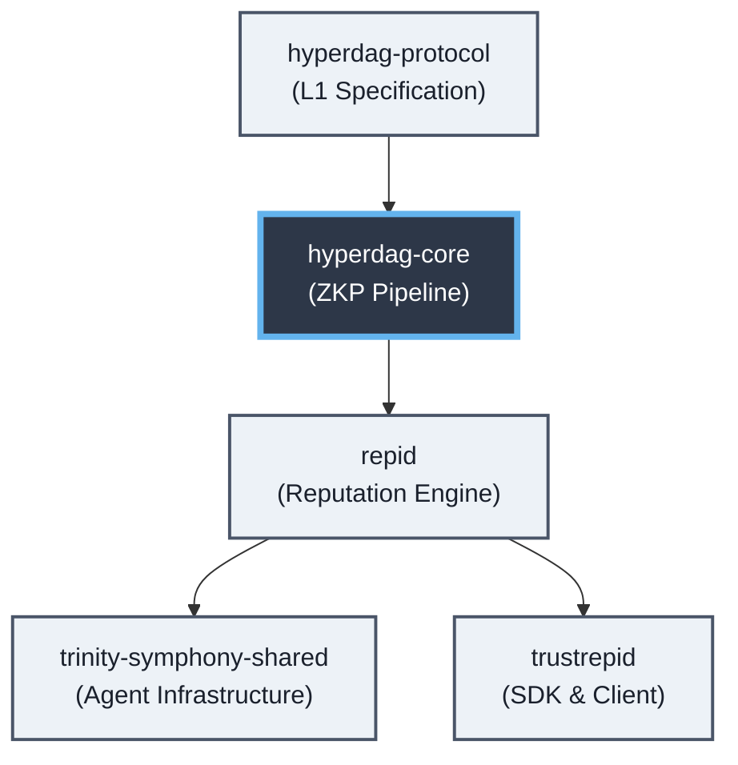

# hyperdag-core

Core ZKP Pipelines and Primitives

## HyperDAG Ecosystem

## Overview
This repository is part of the HyperDAG ecosystem.
Please see [CC's Specification Docs](/spec/SBT-MINTING-FLOW.md) (placeholder) for detailed architecture flows.

## Getting Started
Please see `.github/CONTRIBUTING.md` for setup.
